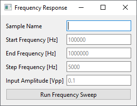
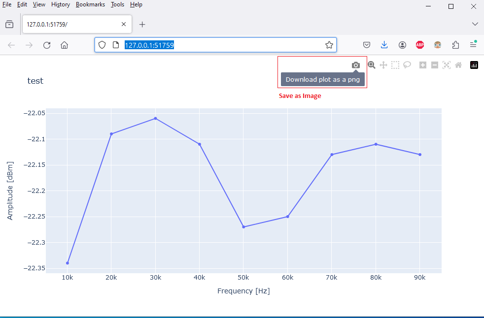
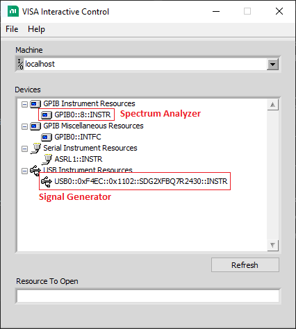

# README

## Running from the Executable

1. Install NI VISA tools according to [Installing NI-VISA Tools](#installing-ni-visa-tools) below. It's free.
2. Run the executable file to open the GUI. You may see a black console window appear as well. You can ignore this but do not close it. It will contain debug statements for troubleshooting.
3. To use the application, set the desired fields and click "Run". The GUI will be disabled for a short time while the test is running, and will open the bode plot in a web browser. See screenshots below.
   1. **Data Labels** - Hover the mouse over points in the graph to see the exact values.
   2. **Zoom** - Use the buttons on the upper right to zoom, reset the view, etc.
   3. **Save** - The bode plot can be saved to disk from the browser (File > Save Page As). This will create two files instead of one- an HTML file and a folder of the same name. Make sure to keep both of them side-by-side or the HTML file will not open. Alternatively, you can use the "Download plot as PNG" button on the upper right, but hovering over the points in the graph will not give data labels this way.  
    

## Running from Source Code

1. Install NI VISA tools according to [Installing NI-VISA Tools](#installing-ni-visa-tools) below.
2. Install Python 3.x from [here](https://www.python.org/downloads/)
3. Create and activate a Python virtual environment, called ".venv" in this example. Virtual environments let Python apps use their own set of dependencies without interfering with the global Python environment installed on the system. You only need to create the environment once, but have to activate the environment with the last line each time you open a new console.

   ```bat
   cd program
   python -m venv .venv
   .venv\Scripts\activate.bat
   ```

4. Install dependencies. The requirements.txt file contains all Python dependencies needed by the application.

   ```bat
   python -m pip install -r requirements.txt
   ```

5. Run instrument_controller.py.
6. To set up a Python development environment for VSCode, follow the [Quick Start Guide](https://code.visualstudio.com/docs/python/python-quick-start). This allows single stepping through code easily.
   - Make sure to set the Python interpreter in VS Code to use the venv created above.

## Installing NI-VISA Tools

1. Download and install the NI-VIA tools from [here](https://www.ni.com/en/support/downloads/drivers/download.ni-visa.html#521671).
2. Connect both instruments to the PC and power them on.
3. Open the "NI-VISA Interactive Control" application and make sure they are both listed under devices. Look for an address ending in "::INSTR". This means NI-VISA recognized the instruments. The address doesn't have to match the screenshot exactly. You can then close this.  
   

## Re-Generating the Executable

This explains how to create the executable so client's don't need to have a full dev environment.

1. Follow the steps in [Running from Source Code](#running-from-source-code)
2. Install PyInstaller then activate the virtual environment.

   ```bat
   pip install pyinstaller setuptools
   ```

3. Activate the virtual environement and create the executable. This will place the executable in "program/dist/instrument_controller.exe". It may take a while.
   ```bat
   cd program
   .venv\Scripts\activate.bat
   pyinstaller --paths=.venv\Lib\site-packages --onefile instrument_controller.py
   ```
   - You can add the `--noconsole` option to disable the black console window with debug info.

## Miscellaneous

Protocol documentation for the instruments is in the "manuals" folder.